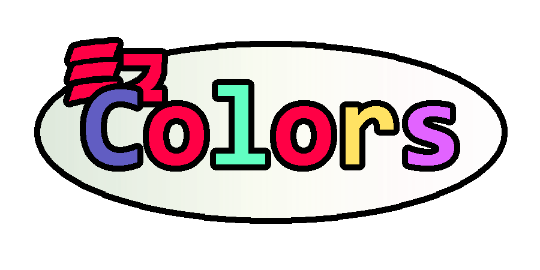

 
  
 
 
 

# EzConsole

EzConsole is a collection of modules included in the EzConsole NuGet Package, this is all bundled together to form this complete set of better functionalities added and wrapped around the `System.Console` class.

Here is an overview of all the modules added in the EzConsole Collection Package:

 

## EzColors
A .NET Standard library built for simple and accessible command line argument parsing, manual instructions and validation.

### Usage

#### Examples

##### 1. Static Manual
